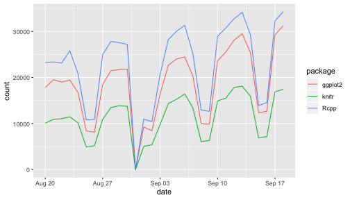
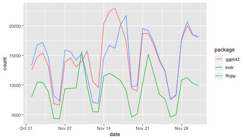

```
## Error in library(Ecdat): there is no package called 'Ecdat'
```

This small data analysis project explores some trends in R package downloads over time. The datasets are downloaded using the [cranlogs package](https://github.com/metacran/cranlogs).


```r
library(cranlogs)
cran_downloads(packages = "dplyr", when = "last-week")
##         date count package
## 1 2018-09-12 21467   dplyr
## 2 2018-09-13 22605   dplyr
## 3 2018-09-14 20663   dplyr
## 4 2018-09-15  9404   dplyr
## 5 2018-09-16  9504   dplyr
## 6 2018-09-17 22604   dplyr
## 7 2018-09-18 24369   dplyr
```


# Results

We look at download trends in the following packages.


```r
library(drake)
readd(package_list) # see also loadd() # nolint
## [1] "knitr"   "Rcpp"    "ggplot2"
```

Using the [cranlogs package](https://github.com/metacran/cranlogs), we calculate the mean number of downloads for each package from the RStudio CRAN mirror. We show these averages for the last month,


```r
readd(averages_recent)
## # A tibble: 3 x 2
##   package      m
##   <chr>    <dbl>
## 1 ggplot2 18513.
## 2 knitr   11277.
## 3 Rcpp    22616.
```

and from November 1 to December 1 in 2016.


```r
readd(averages_older)
## # A tibble: 3 x 2
##   package      m
##   <chr>    <dbl>
## 1 ggplot2 14641.
## 2 knitr    9069.
## 3 Rcpp    14408.
```

We visualize the daily downloads from the last month,


```r
readd(plot_recent)
```



and from November 1 to December 1 in 2016.


```r
readd(plot_older)
```


